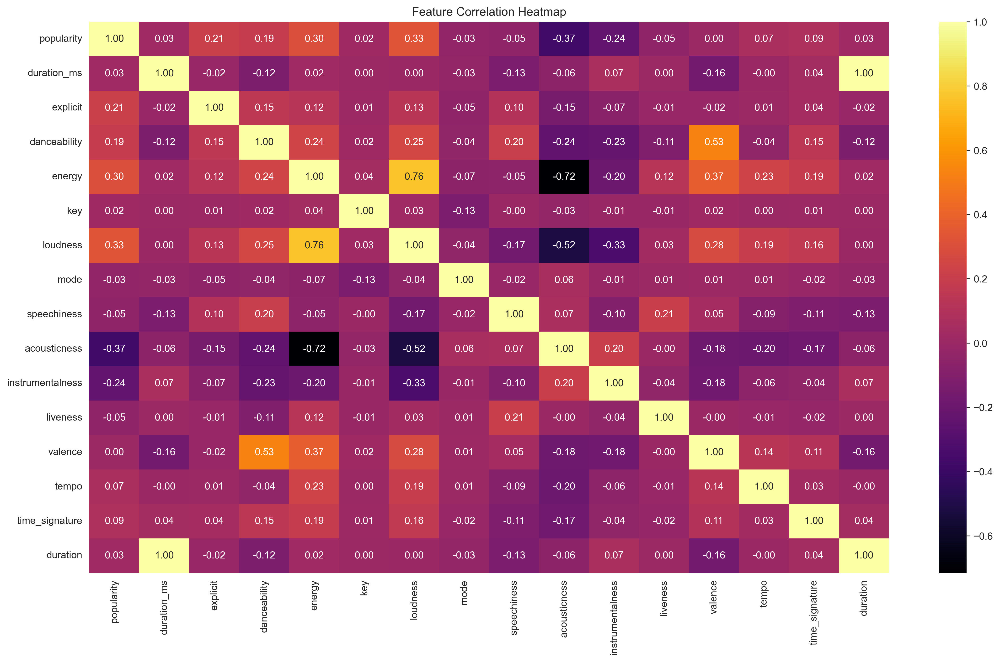
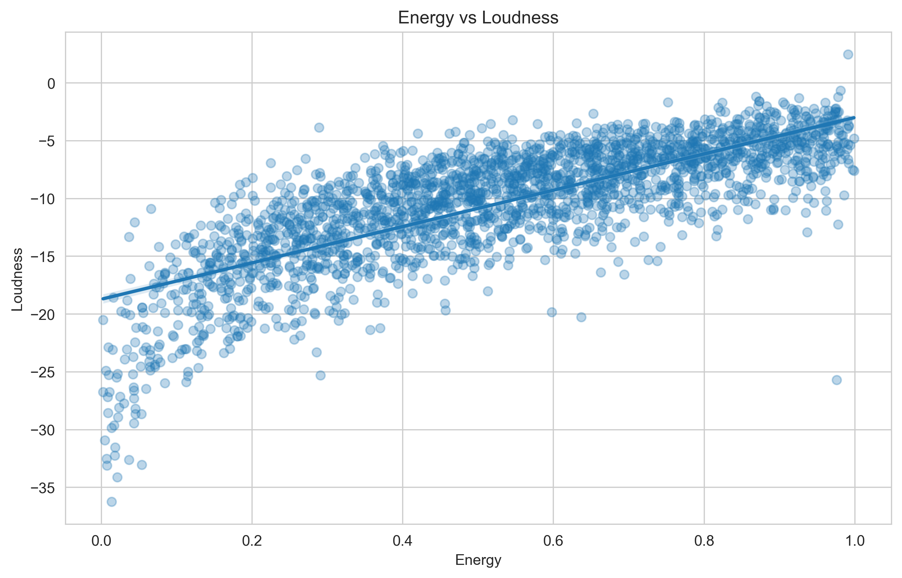
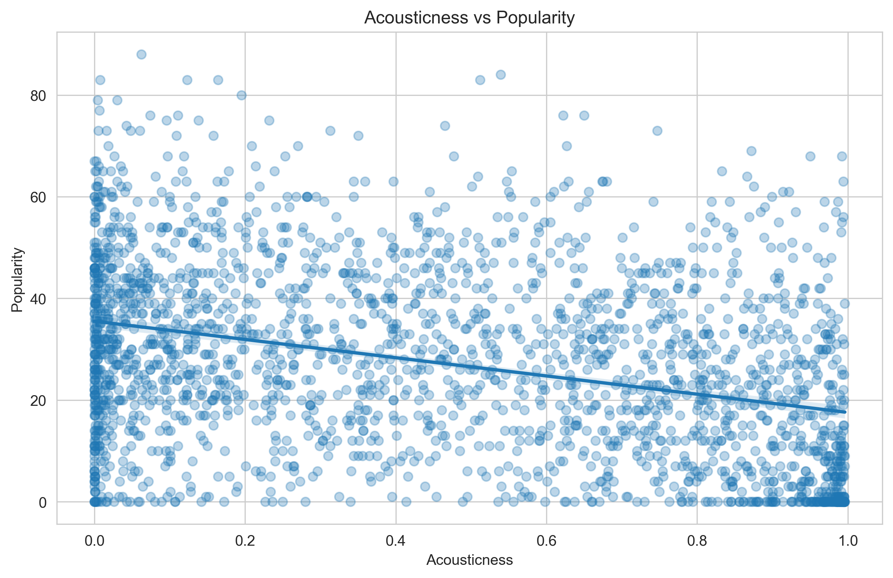
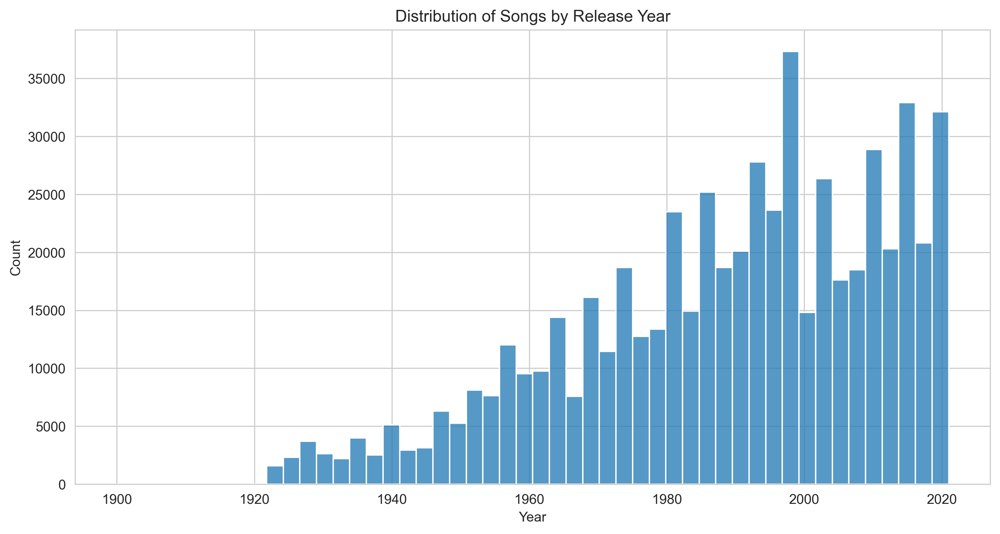

#  Spotify Music Data Analysis

##  Overview
This project analyzes Spotify track data to explore relationships between audio features and song popularity.

##  Key Insights
- Energy and loudness are strongly correlated
- Acoustic songs tend to be less popular
- Music production increased after 1980

##  Visualizations

### Heatmap

### Energy vs Loudness

### Acousticness vs Popularity

### Year Distribution

